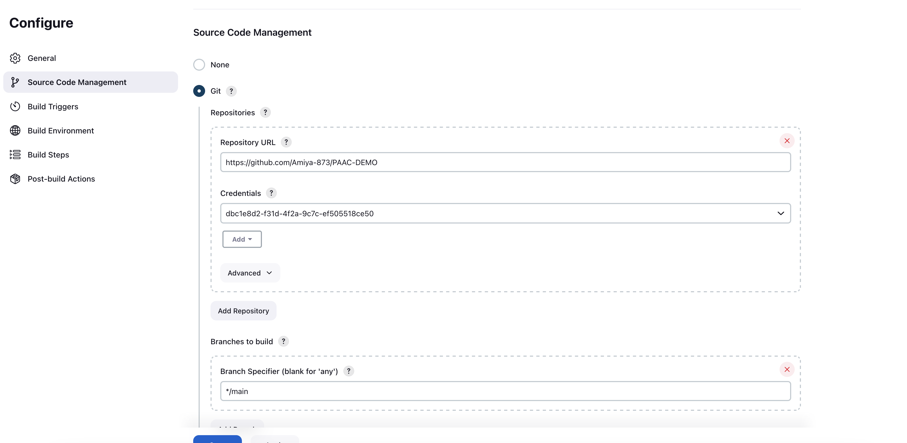
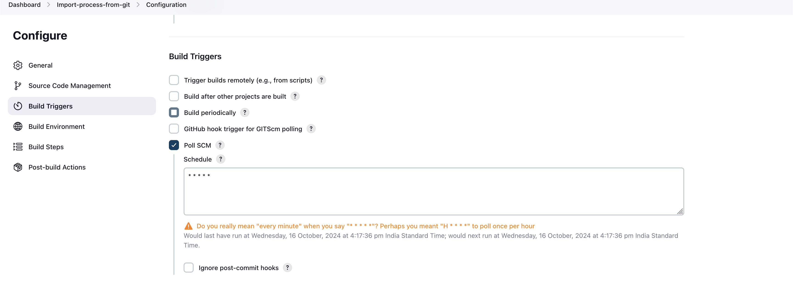
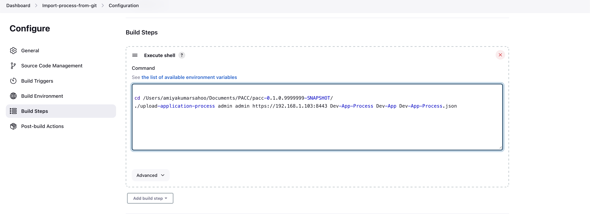

## Usage

### Steps to Integrate PAAC with DevOps Deploy using Jenkins

#### Illustration of an Integration Architecture

##### Prerequisites:
- Jenkins should be installed.
- The PAAC CLI should be present on the machine where the Jenkins server is installed.
- Permissions to update the process being worked on.

##### Problem Statement:
Need to update an existing process stored in GitHub in JSON format to DevOps Deploy. The process can be of any type: **Generic**, **Component**, or **Application**.

### Configurations Needed in Jenkins:

1. **Create a New Freestyle Project**  
   In Jenkins, create a new Freestyle project. Name it something like "Import-process-from-git".

2. **Configure the Source Code Management Section**  
   Add the Git credentials where the processes are stored.  
   

3. **Configure the Build Triggers Section**  
   Check the "Poll SCM" checkbox.  
   In the "Schedule" text box, provide `* * * * *` to poll for changes every minute from the Git repo.  
   

4. **Configure the Build Steps Section**  
   Add an "Execute Shell" option.  
   In the "Execute Shell" command box, change the current working directory to the directory where the PAAC CLI is present.  
   Then execute the command (refer to the **List of All Commands** section) according to the type of process you're working with.  
   

5. **Make Changes to Your JSON File**  
   Use any IDE to make changes to the JSON file and push the changes to GitHub.

6. **Jenkins Polling and Job Trigger**  
   Once changes are merged to the main or master branch (depending on your setup in step 2), Jenkins will poll the repository and trigger a job.  
   This will result in updating the process in DevOps Deploy.

---

### List of All Commands:

- **Download a Generic Process**  
  **Syntax**:  
  `download-generic-process <username> <password> <server-url> <process-name> <output-file>`  
  **Example**:  
  `download-generic-process myuser mypassword https://url:8443 myGenericProcessName myGenericProcess.json`

- **Download a Component Process**  
  **Syntax**:  
  `download-component-process <username> <password> <server-url> <component-process-name> <component-name> <output-file>`  
  **Example**:  
  `download-component-process myuser mypassword https://url:8443 myComponentProcessName myComponentName myComponentProcess.json`

- **Download an Application Process**  
  **Syntax**:  
  `download-application-process <username> <password> <server-url> <application-process-name> <application-name> <output-file>`  
  **Example**:  
  `download-application-process myuser mypassword https://url:8443 myApplicationProcessName myApplicationName myApplicationProcess.json`

- **Upload a Generic Process**  
  **Syntax**:  
  `upload-generic-process <username> <password> <server-url> <process-name> <input-file>`  
  **Example**:  
  `upload-generic-process myuser mypassword https://url:8443 myGenericProcessName myGenericProcess.json`

- **Upload a Component Process**  
  **Syntax**:  
  `upload-component-process <username> <password> <server-url> <component-process-name> <component-name> <input-file>`  
  **Example**:  
  `upload-component-process myuser mypassword https://url:8443 myComponentProcessName myComponentName myComponentProcess.json`

- **Upload an Application Process**  
  **Syntax**:  
  `upload-application-process <username> <password> <server-url> <application-process-name> <application-name> <input-file>`  
  **Example**:  
  `upload-application-process myuser mypassword https://url:8443 myApplicationProcessName myApplicationName myApplicationProcess.json`
